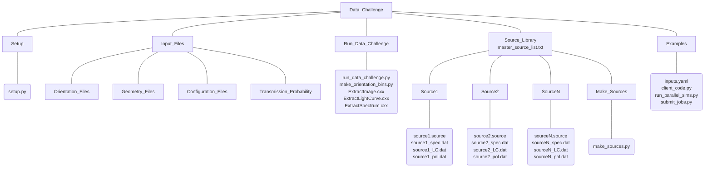

```mermaid
%%{init: {'theme':'default'}}%%
graph TD;
    A[Data_Challenge] --- B[Setup] & C[Input_Files] & D[Run_Data_Challenge] & E[Source_Library<br>master_source_list.txt] & F[Examples];
    B --- Ba(setup.py);
    C --- Ca["Orientation_Files"];
    C --- Cb[Geometry_Files];
    C --- Cd[Configuration_Files];
    C --- Ce["Transmission_Probability"];
    D --- Da(run_data_challenge.py<br>make_orientation_bins.py<br>ExtractImage.cxx<br>ExtractLightCurve.cxx<br>ExtractSpectrum.cxx);
    E --- Ea[Source1];
    E --- Eb[Source2];
    E --- Ec[SourceN];
    E --- Ed[Make_Sources];
    Ea --- Eaa(source1.source<br>source1_spec.dat<br>source1_LC.dat<br>source1_pol.dat);
    Eb --- Ebb(source2.source<br>source2_spec.dat<br>source2_LC.dat<br>source2_pol.dat);
    Ec --- Ecc(sourceN.source<br>sourceN_spec.dat<br>sourceN_LC.dat<br>sourceN_pol.dat);
    Ed --- Edd(make_sources.py);
    F --- Fa(inputs.yaml<br>client_code.py<br>run_parallel_sims.py<br>submit_jobs.py);
```
